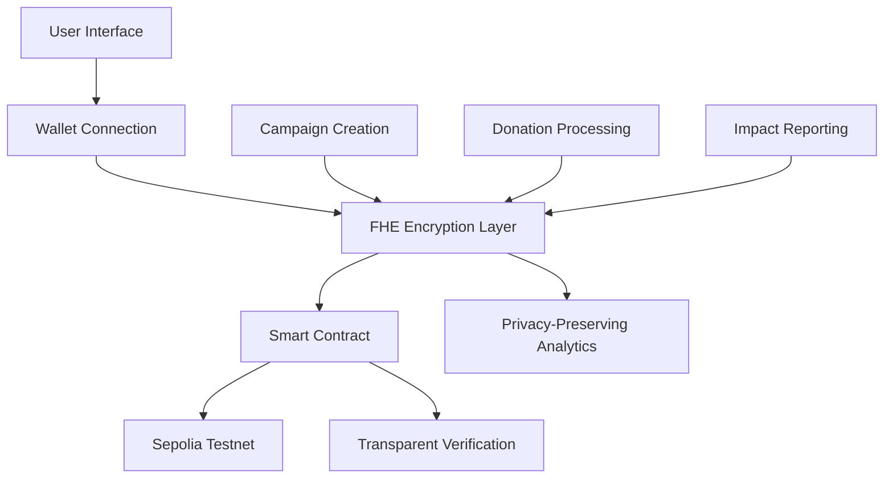

<div align="center">

# 🌟 Fund Shadow

### *Where Privacy Meets Philanthropy*

[](https://opensource.org/licenses/MIT)
[](https://www.typescriptlang.org/)
[](https://reactjs.org/)
[](https://ethereum.org/)

*Revolutionary charity platform powered by Fully Homomorphic Encryption*

</div>

---

## 🚀 What Makes Fund Shadow Special?

Fund Shadow isn't just another charity platform—it's a **privacy-first revolution** in philanthropic giving. Built on cutting-edge FHE (Fully Homomorphic Encryption) technology, we ensure your generosity remains both impactful and private.

### 🔐 Privacy Without Compromise
- **Zero-Knowledge Donations**: Your donation amounts stay encrypted, even during processing
- **Anonymous Impact**: Track results without revealing personal giving patterns
- **Secure Analytics**: Platform insights without compromising individual privacy

### 🌍 Global Impact, Local Privacy
- **Transparent Campaigns**: Full visibility into how funds are used
- **Verified Impact**: Community-driven verification of charitable outcomes
- **Multi-Chain Ready**: Built for Ethereum with future expansion planned

---

## 🛠️ Tech Stack

<table>
<tr>
<td align="center" width="33%">
<strong>Frontend</strong><br/>
React 18 • TypeScript • Vite<br/>
shadcn/ui • Tailwind CSS
</td>
<td align="center" width="33%">
<strong>Blockchain</strong><br/>
Ethereum Sepolia • FHEVM<br/>
RainbowKit • Wagmi • Viem
</td>
<td align="center" width="33%">
<strong>Security</strong><br/>
FHE Encryption • Smart Contracts<br/>
Zero-Knowledge Proofs
</td>
</tr>
</table>

---

## ⚡ Quick Start

### Prerequisites
- **Node.js** 18+ 
- **npm** or **yarn**
- **Web3 Wallet** (MetaMask, Rainbow, etc.)

### Installation

```bash
# 🎯 Clone the repository
git clone https://github.com/metachain-org/fund-shadow.git
cd fund-shadow

# 📦 Install dependencies
npm install

# 🚀 Start development server
npm run dev
```

### 🔧 Environment Setup

Create `.env.local` in your project root:

```env
# Blockchain Configuration
NEXT_PUBLIC_CHAIN_ID=11155111
NEXT_PUBLIC_RPC_URL=https://sepolia.infura.io/v3/YOUR_INFURA_KEY
NEXT_PUBLIC_WALLET_CONNECT_PROJECT_ID=YOUR_WALLETCONNECT_ID

# Optional: Additional RPC endpoints
NEXT_PUBLIC_INFURA_API_KEY=YOUR_INFURA_KEY
```

---

## 🏗️ Architecture Overview



---

## 🎯 Core Features

### 🔒 **Encrypted Campaign Management**
- Create campaigns with FHE-encrypted target amounts
- Privacy-preserving donation tracking
- Secure fund allocation mechanisms

### 💰 **Anonymous Donations**
- Donate without revealing exact amounts
- Maintain privacy while ensuring transparency
- Encrypted transaction processing

### 📊 **Impact Analytics**
- Real-time impact reporting
- Community-driven verification
- Privacy-preserving analytics dashboard

### 🏆 **Reputation System**
- Encrypted donor reputation scoring
- Charity verification mechanisms
- Trust-based platform governance

---

## 🚀 Development

### Available Commands

```bash
npm run dev          # 🏃‍♂️ Start development server
npm run build        # 🏗️ Build for production
npm run preview      # 👀 Preview production build
npm run lint         # 🔍 Run ESLint
```

### Project Structure

```
fund-shadow/
├── 📁 src/
│   ├── 🧩 components/     # Reusable UI components
│   ├── 📄 pages/          # Application pages
│   ├── 🎣 hooks/          # Custom React hooks
│   ├── 📚 lib/            # Utility functions
│   └── 🔗 contracts/      # Smart contract interfaces
├── 📁 contracts/          # Solidity smart contracts
├── 📁 public/             # Static assets
└── 📄 Configuration files
```

---

## 🌐 Deployment

### Vercel (Recommended)

1. **Connect Repository**: Link your GitHub repo to Vercel
2. **Configure Environment**: Add environment variables
3. **Deploy**: Automatic deployment on push to main

### Manual Deployment

```bash
# Build the project
npm run build

# Deploy dist/ folder to your hosting service
```

📖 **Detailed deployment guide**: See [DEPLOYMENT.md](./DEPLOYMENT.md)

---

## 🤝 Contributing

We welcome contributions! Here's how to get started:

1. **🍴 Fork** the repository
2. **🌿 Create** a feature branch (`git checkout -b feature/amazing-feature`)
3. **💾 Commit** your changes (`git commit -m 'Add amazing feature'`)
4. **📤 Push** to the branch (`git push origin feature/amazing-feature`)
5. **🔄 Open** a Pull Request

### Development Guidelines

- Follow TypeScript best practices
- Write comprehensive tests
- Update documentation
- Follow conventional commit messages

---

## 📄 License

This project is licensed under the **MIT License** - see the [LICENSE](LICENSE) file for details.

---

## 🆘 Support & Community

- **🐛 Bug Reports**: [GitHub Issues](https://github.com/metachain-org/fund-shadow/issues)
- **💬 Discussions**: [GitHub Discussions](https://github.com/metachain-org/fund-shadow/discussions)
- **📧 Contact**: [Project Team](mailto:support@fundshadow.org)

---

<div align="center">

**Built with ❤️ by the Fund Shadow Team**

*Empowering privacy-preserving philanthropy through cutting-edge technology*

[⬆ Back to Top](#-fund-shadow)

</div>
