<div align="center">

# 💎 Fund Shadow

### *The Future of Private Philanthropy*

[](https://opensource.org/licenses/MIT)
[](https://www.typescriptlang.org/)
[](https://reactjs.org/)
[](https://ethereum.org/)
[](https://fhevm.org/)

*Next-generation charity platform with zero-knowledge privacy*

</div>

---

## ⚡ Why Fund Shadow is Revolutionary

Fund Shadow represents a **paradigm shift** in charitable giving. We've reimagined philanthropy for the Web3 era, combining the transparency of blockchain with the privacy of advanced cryptography.

### 🎯 Core Innovation
- **🔒 FHE-Powered Privacy**: Your donations are encrypted end-to-end using Fully Homomorphic Encryption
- **🗳️ Anonymous Voting**: Participate in governance without revealing your identity or stake
- **📊 Zero-Knowledge Analytics**: Get insights without exposing sensitive data
- **🌐 Decentralized Trust**: No single point of failure or control

### 🚀 Advanced Features
- **Smart Campaign Management**: AI-assisted campaign creation and optimization
- **Dynamic Impact Tracking**: Real-time verification of charitable outcomes
- **Cross-Chain Compatibility**: Future-ready for multi-blockchain deployment
- **Community Governance**: Decentralized decision-making for platform evolution

---

## 🛠️ Tech Stack

<table>
<tr>
<td align="center" width="33%">
<strong>Frontend</strong><br/>
React 18 • TypeScript • Vite<br/>
shadcn/ui • Tailwind CSS
</td>
<td align="center" width="33%">
<strong>Blockchain</strong><br/>
Ethereum Sepolia • FHEVM<br/>
RainbowKit • Wagmi • Viem
</td>
<td align="center" width="33%">
<strong>Security</strong><br/>
FHE Encryption • Smart Contracts<br/>
Zero-Knowledge Proofs
</td>
</tr>
</table>

---

## ⚡ Quick Start

### Prerequisites
- **Node.js** 18+ 
- **npm** or **yarn**
- **Web3 Wallet** (MetaMask, Rainbow, etc.)

### Installation

```bash
# 🎯 Clone the repository
git clone https://github.com/metachain-org/fund-shadow.git
cd fund-shadow

# 📦 Install dependencies
npm install

# 🚀 Start development server
npm run dev
```

### 🔧 Environment Setup

Create `.env.local` in your project root:

```env
# Blockchain Configuration
NEXT_PUBLIC_CHAIN_ID=11155111
NEXT_PUBLIC_RPC_URL=https://sepolia.infura.io/v3/YOUR_INFURA_KEY
NEXT_PUBLIC_WALLET_CONNECT_PROJECT_ID=YOUR_WALLETCONNECT_ID

# Optional: Additional RPC endpoints
NEXT_PUBLIC_INFURA_API_KEY=YOUR_INFURA_KEY
```

---

## 🏗️ Revolutionary Architecture

```mermaid
graph TB
    A[💎 Fund Shadow UI] --> B[🔗 RainbowKit Wallet]
    B --> C[🔐 FHE Encryption Engine]
    C --> D[📜 FundShadow Contract]
    D --> E[🌐 Sepolia Testnet]

    F[🗳️ Anonymous Voting] --> C
    G[💰 Encrypted Donations] --> C
    H[📊 Zero-Knowledge Analytics] --> C

    C --> I[🛡️ Privacy Layer]
    D --> J[✅ Transparent Verification]
    I --> K[🎯 Impact Tracking]
    J --> K

    style A fill:#7c3aed,stroke:#3b82f6,color:#fff
    style C fill:#f59e0b,stroke:#d97706,color:#fff
    style D fill:#10b981,stroke:#059669,color:#fff
```



---

## 🎯 Revolutionary Features

### 🗳️ **Anonymous Voting System**
- **FHE-Encrypted Ballots**: Vote privately with fully homomorphic encryption
- **Zero-Knowledge Proofs**: Verify vote integrity without revealing choices
- **Decentralized Governance**: Community-driven decision making

### 💎 **Privacy-First Donations**
- **Encrypted Amounts**: Donate without revealing exact values
- **Anonymous Impact**: Track results while maintaining privacy
- **Smart Contract Integration**: Automated fund distribution

### 📊 **Advanced Analytics**
- **Zero-Knowledge Insights**: Get platform analytics without data exposure
- **Real-Time Verification**: Community-driven impact validation
- **Cross-Chain Compatibility**: Future-ready for multi-blockchain deployment

### 🚀 **Next-Gen Features**
- **AI-Powered Campaigns**: Smart campaign optimization
- **Dynamic Reputation**: Encrypted donor scoring system
- **Community Governance**: Decentralized platform evolution

---

## 🚀 Development

### Available Commands

```bash
npm run dev          # 🏃‍♂️ Start development server
npm run build        # 🏗️ Build for production
npm run preview      # 👀 Preview production build
npm run lint         # 🔍 Run ESLint
```

### Project Structure

```
fund-shadow/
├── 📁 src/
│   ├── 🧩 components/     # Reusable UI components
│   ├── 📄 pages/          # Application pages
│   ├── 🎣 hooks/          # Custom React hooks
│   ├── 📚 lib/            # Utility functions
│   └── 🔗 contracts/      # Smart contract interfaces
├── 📁 contracts/          # Solidity smart contracts
├── 📁 public/             # Static assets
└── 📄 Configuration files
```

---

## 🌐 Deployment

### Vercel (Recommended)

1. **Connect Repository**: Link your GitHub repo to Vercel
2. **Configure Environment**: Add environment variables
3. **Deploy**: Automatic deployment on push to main

### Manual Deployment

```bash
# Build the project
npm run build

# Deploy dist/ folder to your hosting service
```

📖 **Detailed deployment guide**: See [DEPLOYMENT.md](./DEPLOYMENT.md)

---

## 🤝 Contributing

We welcome contributions! Here's how to get started:

1. **🍴 Fork** the repository
2. **🌿 Create** a feature branch (`git checkout -b feature/amazing-feature`)
3. **💾 Commit** your changes (`git commit -m 'Add amazing feature'`)
4. **📤 Push** to the branch (`git push origin feature/amazing-feature`)
5. **🔄 Open** a Pull Request

### Development Guidelines

- Follow TypeScript best practices
- Write comprehensive tests
- Update documentation
- Follow conventional commit messages

---

## 📄 License

This project is licensed under the **MIT License** - see the [LICENSE](LICENSE) file for details.

---

## 🆘 Support & Community

- **🐛 Bug Reports**: [GitHub Issues](https://github.com/metachain-org/fund-shadow/issues)
- **💬 Discussions**: [GitHub Discussions](https://github.com/metachain-org/fund-shadow/discussions)
- **📧 Contact**: [Project Team](mailto:support@fundshadow.org)

---

<div align="center">

**Built with ❤️ by the Fund Shadow Team**

*Empowering privacy-preserving philanthropy through cutting-edge technology*

[⬆ Back to Top](#-fund-shadow)

</div>
